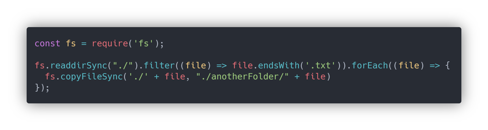

# Code

> OTW-2

**We will never give you a fully completed piece of code - with exceptions.**

We always use code screenshots instead of code blocks, this means you have to read the code instead of just copying and pasting.

If you are wondering what we use, we use [Carbon ](https://carbon.now.sh/)

### Example

> Example taken from SCM-5

**You can easily separate your c\# files** and copy them to a **DLLMod folder** using a simple NodeJS script.

This **script** will copy all files in the same folder as the script with the file extension of `.txt` into the **"anotherFolder"** folder.



If you are following the track "OTW".

#### Previous page: [OTW-1 Basics](otw-1.md)

#### Next page:[OTW-3 Sending in Work](otw-3.md)



