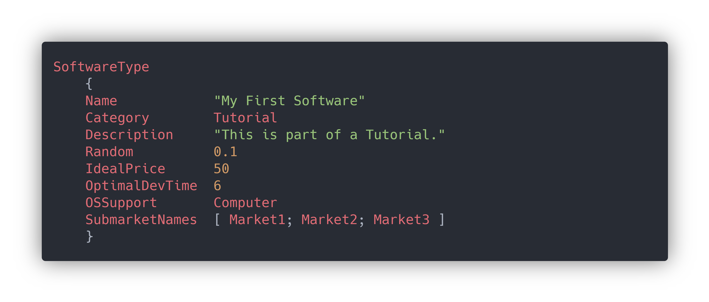

# Your First Software Type

> SIM-2

To begin, create a folder for your mod name it `MyFirstDataMod`. Inside that folder create a folder called `SoftwareTypes`. This is where your software will go.

Create a file called `MyFirstSoftware.tyd`, open it in a text editor \(we recommend [VScode](https://code.visualstudio.com/) as it is the only editor with a [TyD language extension](https://marketplace.visualstudio.com/items?itemName=Matthew-Adcock.tyd-lang)\). 

**You are now ready to begin.**

On the first line write `SoftwareType`This defines the type of TyD table you will be creating. Then open a set of curly brackets `{}` inside these curly brackets create a name record `name "My First Software"`. Continue creating records until your file looks like this:

More information about each of the elements can be found in [this table](https://softwareinc.coredumping.com/wiki/index.php/Data_Modding#Elements) on the official wiki.

But for your sakes, let us break it down in a simpler form:


For a list of variables and examples, see here: [TyD Variable Types](tyd-variable-types.md)


| **Variable** | Variable Type | **Description** | **Example** |
| :---: | :---: | :---: | :---: |
| Name | String | The name of the software type. | `"Video Editor"` |
| Category | Unmarked String | The category the software type is mentioned as in the Software Times | `Video Editing` |
| Random | Float | How much sales will vary, 0.1 being 10% | `0.45` \(45%\) etc. |
| Description | String | The description of the software. | `"A editor that edits videos"` |
| IdealPrice | Float or Integer | The price if all features are selected. | `50` or `9.99`etc. |
| OptimalDevTime | Integer | The time in months it will take to develop the core software. | `3` or `5` etc. |
| OSSupport | Unmarked string or List | The OS Categories the software can be used on. | `Computer` or `Mobile` or `Console` or a list of them. |
| Submarket Names | List of Unmarked solo strings. | The names of the submarkets, critics favour some more than others. | `[Usability; Complexity; Speed]`  |

