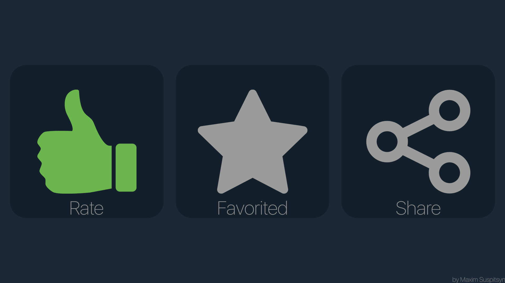
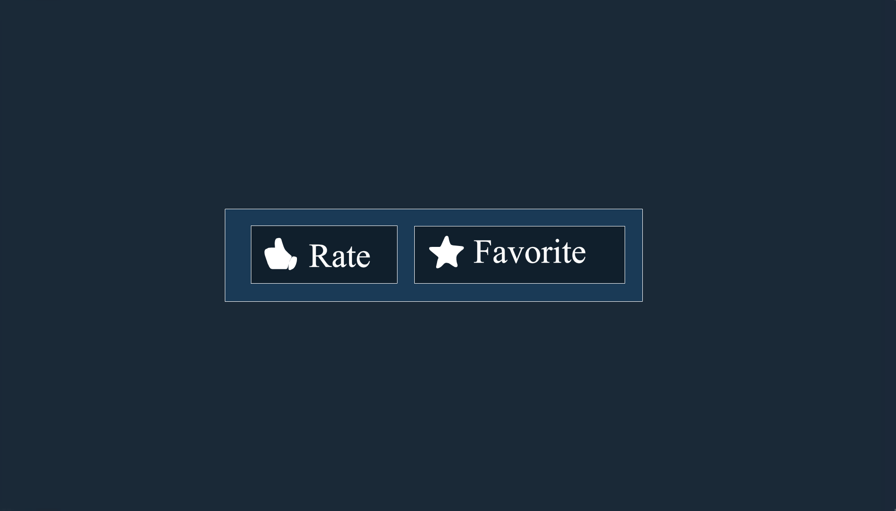

# Descriptions

> wim-2

Did you know that only 45% of steam workshop users read the description? If you think about it. There are **20.31 million** steam users that play daily. Which means only 9,139,500 players actually check the description.

This may seem a lot, but that's all the games on steam combined.


The statistics are from steam, if you would like to check them out, you can do so here: [https://store.steampowered.com/stats/](https://store.steampowered.com/stats/)


When players do read the description, its usually because they are interested in the mod, something catches their eye or they want more information.

### Catching Eyes

_Now that may sound like something from a horror film, I'm sorry but I couldn't find a better name for it ha._

"Catching Eyes" is the means of making people look at things because they saw something moving, something shiny or something attractive.

Most users look in the description if there is a animated gif;

Here are some examples:











Catchy right?

### Informational

Most people view the description for information. The first 5 lines of the description must not have any BBCode or formatting as BBCode is visible when the user hovers over the item: 

Its best to place a TL:DR \(Too Long Didn't Read\).


You can find a cheat sheet on how to use Steam BBCode here: 

[https://steamcommunity.com/comment/Recommendation/formattinghelp](https://steamcommunity.com/comment/Recommendation/formattinghelp)


#### What is a TL:DR?

A TL:DR is a short sentence that summarises a large paragraph, usually they go at the bottom of the page, but for description purposes, they go at the top.

#### Do's and Don'ts

| **Do** | Don't |
| :---: | :---: |
| Add a TL:DR at the top of your page. | Use BBCode formatting at the top of your page. |
| Use picture banners to separate parts of the description. | Create the entire description using images. |
| Use lists, headings with BBCode to allow users to understand the description. | Use the wrong BBCode Tags for the wrong purpose. |



If you are following the track "WIM".

#### Previous page: [WIM-1 Intro](wim-1.md)

#### Next page: [WIM-3 Preview Images](wim-3.md)



